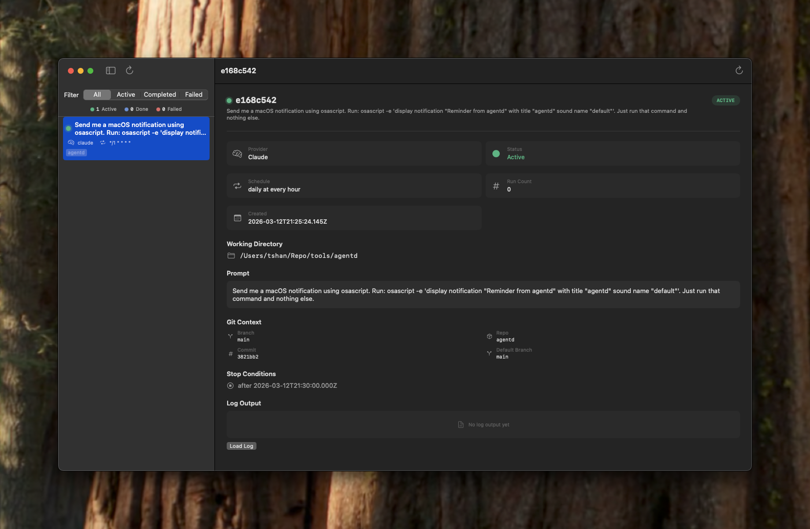
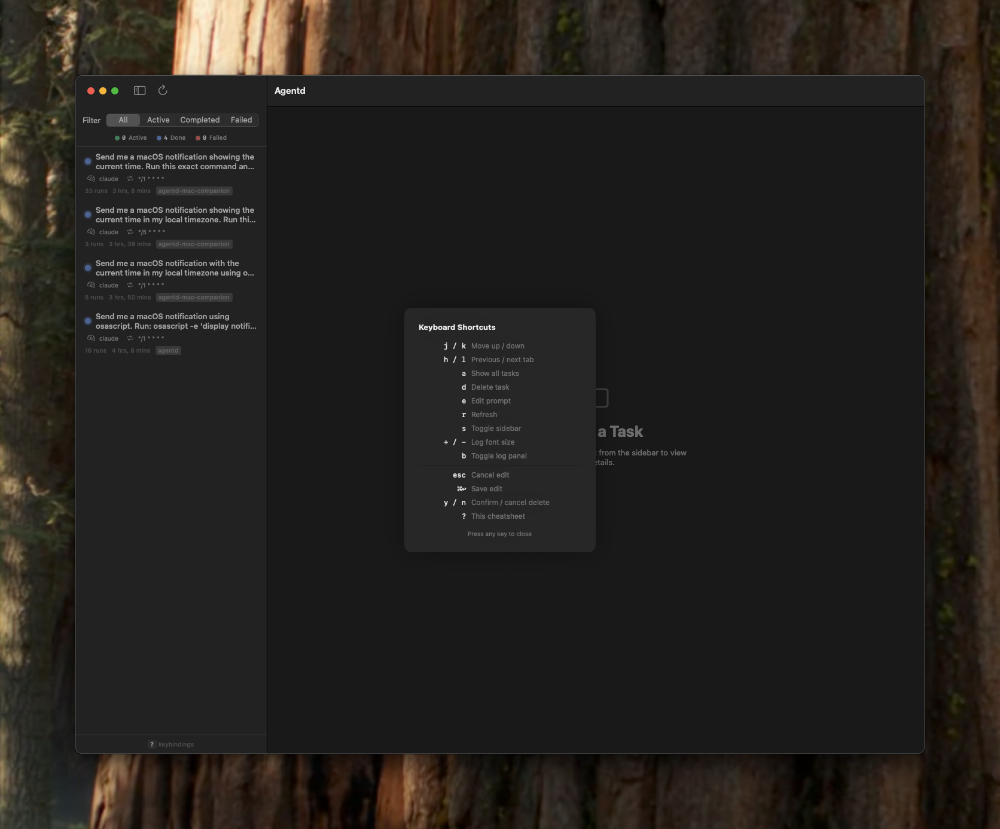

# Agentd for Mac

A native macOS companion app for [agentd](https://github.com/cevr/agentd) — the CLI tool that schedules AI agent tasks (Claude, Codex) via macOS launchd.

<p align="center">
  
</p>

## Overview

Agentd for Mac provides a visual interface to monitor all your scheduled AI agent tasks. It reads directly from agentd's data files (`~/.agentd/`) and auto-refreshes when tasks are added, updated, or removed.

## Features

- **Live task monitoring** — Watches `~/.agentd/tasks/` for changes via FSEvents, auto-refreshes in real time
- **Task filtering** — Filter by status: All, Active, Completed, Failed
- **Rich detail view** — View prompt, schedule, provider, working directory, run count, and timestamps
- **Git context** — See branch, repo, commit, PR number, and issue context captured at task creation
- **Stop conditions** — View max runs, date cutoffs, and conditional stop criteria
- **Log viewer** — Resizable bottom panel with adjustable font size, persisted across launches
- **Clickable PR links** — Jump directly to GitHub pull requests from the detail view
- **Full keyboard support** — Vim-style navigation and shortcuts for every action

## Keyboard Shortcuts

<p align="center">
  
</p>

| Key | Action |
|-----|--------|
| `j` / `k` | Move task selection up / down |
| `h` / `l` | Cycle through filter tabs |
| `a` | Show all tasks |
| `d` | Delete selected task (`y` / `n` to confirm) |
| `e` | Edit prompt (`esc` to cancel, `⌘↩` to save) |
| `r` | Refresh / reload tasks |
| `s` | Toggle sidebar |
| `b` | Toggle log panel |
| `+` / `-` | Adjust log font size |
| `?` | Show keyboard cheatsheet |

## Requirements

- macOS 14.0+
- Xcode 16.0+
- [agentd](https://github.com/cevr/agentd) installed and configured

## Building

```bash
# Generate Xcode project
brew install xcodegen
xcodegen generate

# Build
xcodebuild -project Agentd.xcodeproj -scheme Agentd -configuration Debug build
```

Or open `Agentd.xcodeproj` in Xcode and build with **Cmd+B**.

## How It Works

The app reads agentd's task JSON files from `~/.agentd/tasks/` and log files from `~/.agentd/logs/`. It does not modify any data — it is a read-only companion to the agentd CLI.

```
~/.agentd/
├── tasks/
│   └── {id}.json    ← task definitions (parsed by the app)
└── logs/
    └── {id}.log     ← agent output (viewable in-app)
```

Tasks are created and managed via the agentd CLI:

```bash
# Schedule a recurring task
agentd "babysit this PR" -s "every weekday at 9am" --stop-when "the PR is merged" --max-runs 20

# Schedule a one-shot task
agentd "run tests and report" -s "in 30 minutes"

# List tasks
agentd ls

# Remove a task
agentd rm <id>
```

## License

MIT
